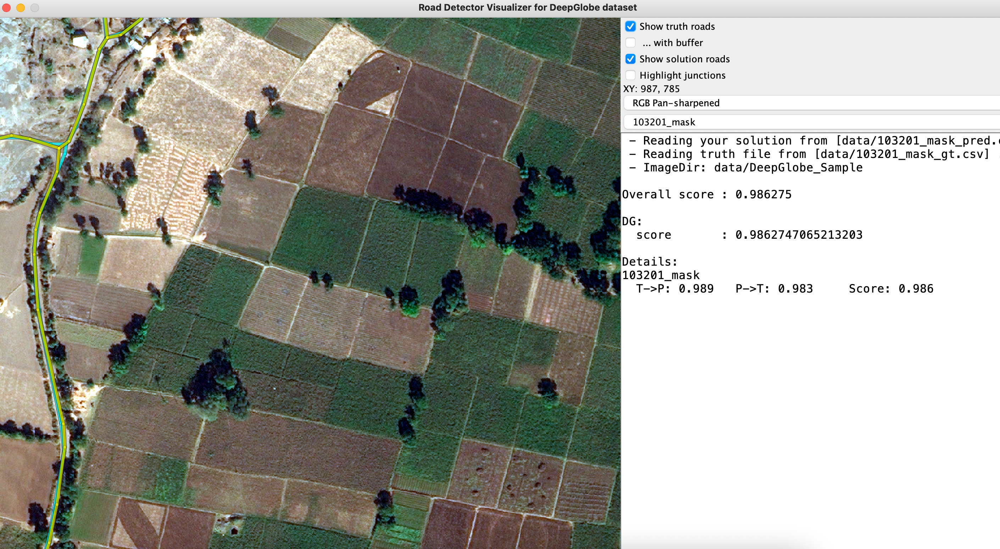

## 通过mask生成apls可视化
### 步骤：
#### 1、执行
```
python getGraphFromImage.py
```
#### 2、执行
```
java -jar visualizerDG.jar -params ./data/paramsDG.txt


参数解释：
solution = /.../masks.csv   #预测结果的csv，执行步骤1生成
truth = /.../labels.csv   #标签的csv，执行步骤1生成
image-dir = /.../imagepath   #原图路径，如果原图是png格式，执行步骤1转换成jpg格式
```

#### 3、可视化


#### Code source: https://github.com/antran89/road_visualizer
